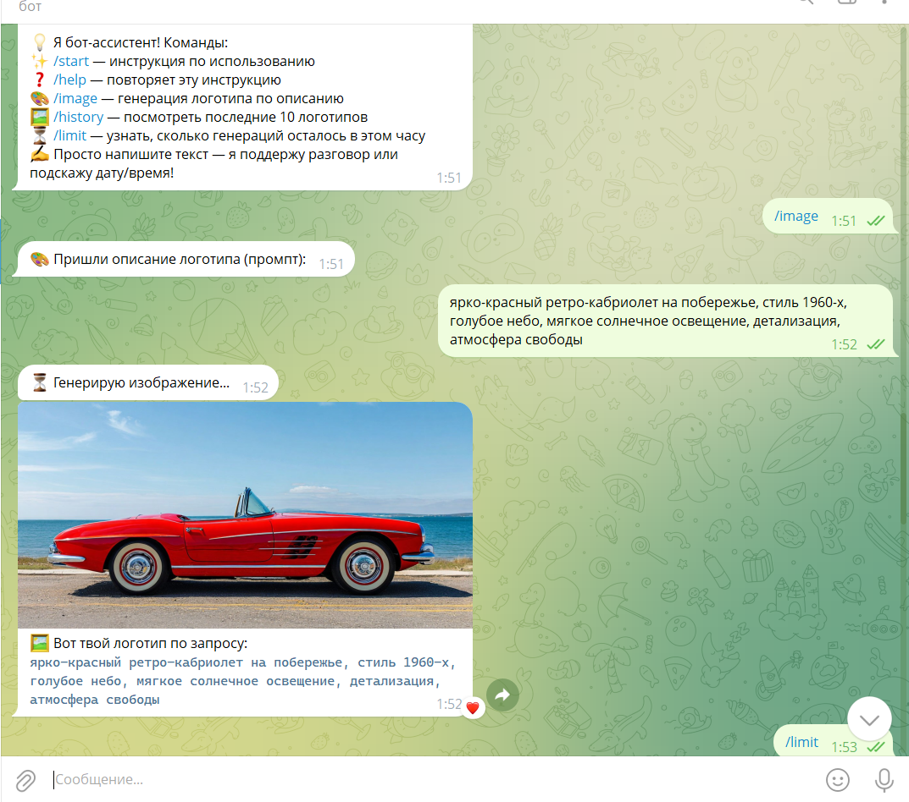
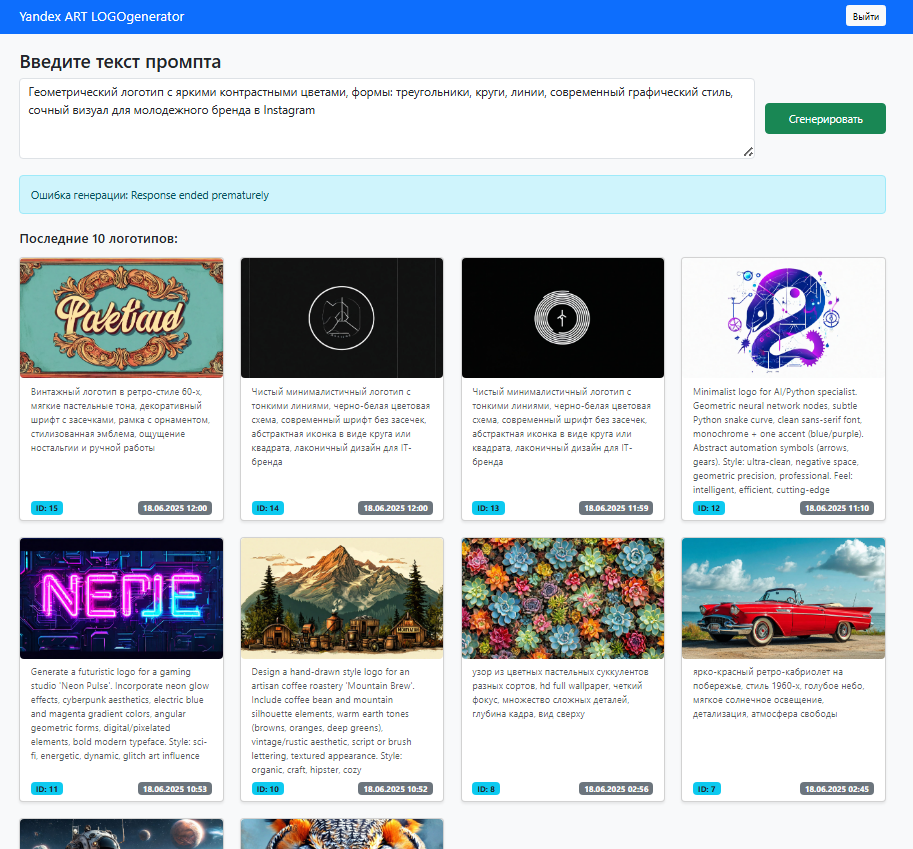

# Yandex ART LOGOgenerator

Генератор логотипов и изображений на базе Yandex ART API с веб-интерфейсом (Flask) и Telegram-ботом на основе Yandex ART.

## 🚀 Возможности

- Генерация изображений/логотипов по текстовому описанию (prompt)
- Личный кабинет с историей последних 10 генераций для каждого пользователя
- Ограничение — не более 5 генераций в час на пользователя
- Авторизация: регистрация и вход через веб-интерфейс
- Telegram-бот для генерации и получения изображений прямо в Telegram
- API-доступ для интеграции (с защитой по API-ключу)
- История генераций отображает уникальный ID и корректное локальное время (Europe/Minsk) внизу карточки

## 🛠️ Быстрый старт

### 1. Клонируй репозиторий
git clone https://github.com/IgorL0SEV/site_bot_image_generation.git
cd site_bot_image_generation

### 2. Создай виртуальное окружение и установи зависимости
python -m venv .venv
.venv\Scripts\activate      # Windows

# source .venv/bin/activate # Linux/MacOS
pip install -r requirements.txt

### 3. Настрой .env
Создай файл .env в корне проекта и заполни:

SECRET_KEY=your_flask_secret_key  
CATALOG_ID=your_yandex_catalog_id  
OAUTH_TOKEN=your_yandex_oauth_token  
MY_API_KEY=your_api_key_for_api_access  
BOT_TOKEN=your_telegram_bot_token  
OPENAI_API_KEY=your_openai_key

### 4. Запусти сайт и бота (в отдельных терминалах)
#### Сайт
python app.py

#### Telegram-бот  
python bot.py

#### Или оба сразу:
python run_all.py

### 🌐 Использование
Перейди на сайт: http://localhost:5000  
Зарегистрируйся и войди в личный кабинет  
Введи промпт (описание картинки) и нажми "Сгенерировать"  
Скачай результат или смотри историю генераций

#### Telegram-бот
Найди своего бота в Telegram, отправь команду /start или /image  
Следуй инструкциям для генерации изображения

### ⚡ API
POST /api/generate  
Заголовок: X-API-KEY: <your_api_key>  
Тело запроса (JSON):  
{ "prompt": "логотип компании с синим кругом и буквой A" }  
Ответ: файл-изображение (image/jpeg)

### 📁 Структура проекта
site_bot_image_generation/
├── .venv/                     # Виртуальное окружение Python  
├── instance/  
│   ├── site.db                # Основная база данных сайта (SQLite)  
│   └── results/               # Картинки - логотипы  
├── templates/                 # HTML-шаблоны Flask  
│   ├── index.html  
│   ├── login.html  
│   └── register.html  
├── .env                       # Переменные окружения (секреты, токены)  
├── .gitignore                 # Исключения для git  
├── .iam_token_cache           # Кэш токена Yandex API  
├── app.py                     # Flask-приложение (веб-интерфейс)  
├── bot.py                     # Telegram-бот  
├── bot_errors.log             # Логи ошибок бота  
├── bot_runner.py              # Автоматический перезапуск бота  
├── run_all.py                 # Запуск сайта и бота вместе  
├── logo_generator.py          # Генератор логотипов (Yandex ART API)  
├── models.py                  # SQLAlchemy-модели  
├── token_updater.py           # Получение и кэширование IAM токена  
├── LICENSE                    # Лицензия проекта  
└── README.md                  # Документация  

### 💡 TODO / Планы
Настроить лимиты и защиту API для production
Сделать мобильную адаптацию интерфейса
Добавить просмотр статистики, расширить админ-панель

